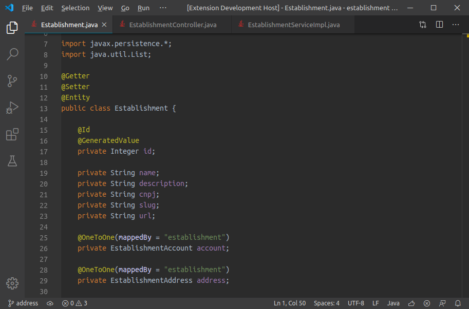

# Darcula (IntelliJ)
Darcula theme for [Visual Studio Code](https://code.visualstudio.com) based on [IntelliJ IDEA](https://www.jetbrains.com/idea)

## Supported syntax
* Java
* Groovy
* JSON
* SQL
* XML
* YAML
* Dockerfile
* Markdown
* Properties

## Screenshots

## Download
This extension is available for free in the [Visual Studio Code Marketplace](https://marketplace.visualstudio.com/items?itemName=rafaelrenanpacheco.darcula-theme).

## What's new?
Take a look at the [changelog](CHANGELOG.md).

## Theme customization
You can customize the colors to your liking, overriding the ones provided by this theme. To know how to customize, [click here](https://code.visualstudio.com/api/references/theme-color) for the official documentation.

## Known issues
* Java - Fields without `this` keyword are not (yet) properly colorized. They will receive the default foreground color. This is an issue regarding the tokenization for the Java language, and was already reported upstream. You can follow it [here](https://github.com/atom/language-java/issues/224).
* Java - Some colors will not be applied due the lack of semantics or more advanced tokenization support.
* SQL - Some colors will not be applied, or will be wrongly applied due bugs on tokenization.

## TODO
The following syntax are common for Visual Studio Code users and will be supported by this theme:
* JavaScript
* TypeScript
* HTML
* CSS

## Contribution
It's very easy to make contributions for this project. You can follow the [official documentation](https://code.visualstudio.com/api/extension-guides/color-theme#test-a-new-color-theme) to learn more details, but to keep it short you can do this:
* Fork this project and clone to your computer.
* Open the project on Visual Studio Code.
  * If this theme is installed, disable it before following the next steps.
* Press F5 to start the `Extension Development Host` mode.
* On the development host make sure this theme is selected.
* Open a folder or a file to preview the changes you will make.
* Open the `themes/darcula.color-theme.json` where you can see the many `tokenColors` rules.
* Add new rules to improve this theme.
* Submit a PR.

In order to identify the `scope` of a token, first go to your file that you are using as reference. Then press `ctrl + shit + p`, search and execute `Developer: Inspect Editor Tokens and Scopes`. Now click on the token that you wish to customize and the inspector will show you the scopes related to that token.

## Credits
* The editor colors were based on [rokoroku/vscode-theme-darcula](https://github.com/rokoroku/vscode-theme-darcula) theme, and changed a little in order to become more like IntelliJ's.
* The token colors were made from scratch and based on IntelliJ IDEA.
